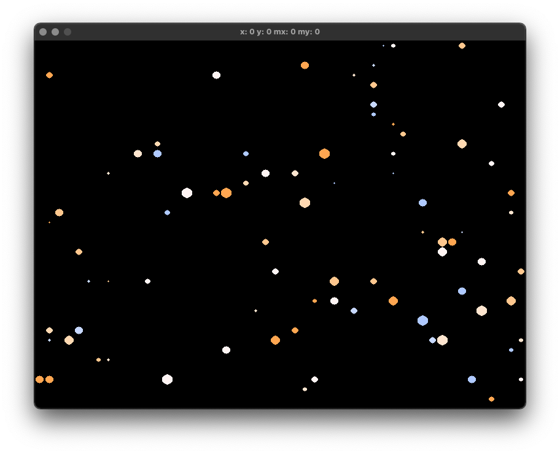
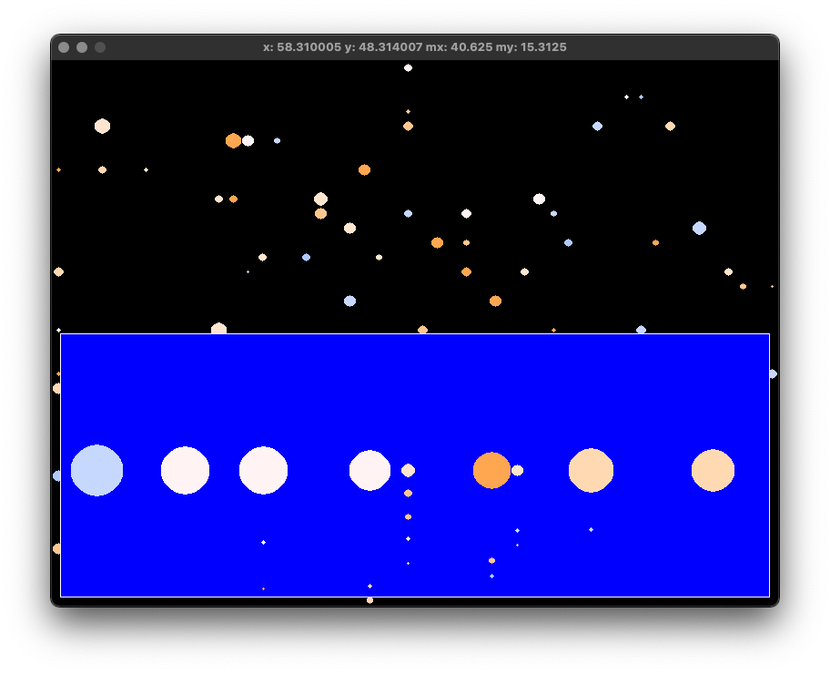

# proc_gen_galaxy

Rust implementation of [OneLoneCoders's](https://github.com/OneLoneCoder), [procedural generation universe](https://github.com/OneLoneCoder/olcPixelGameEngine/blob/master/Videos/OneLoneCoder_PGE_ProcGen_Universe.cpp) (Code base) [Video Explanation](https://www.youtube.com/watch?v=ZZY9YE7rZJw&t=1280s) (Olc's Video)

## Requirements

- SDL2

## Usage

```shell
cargo run
```

## Expected Output

`Galaxy View`



`System View`


